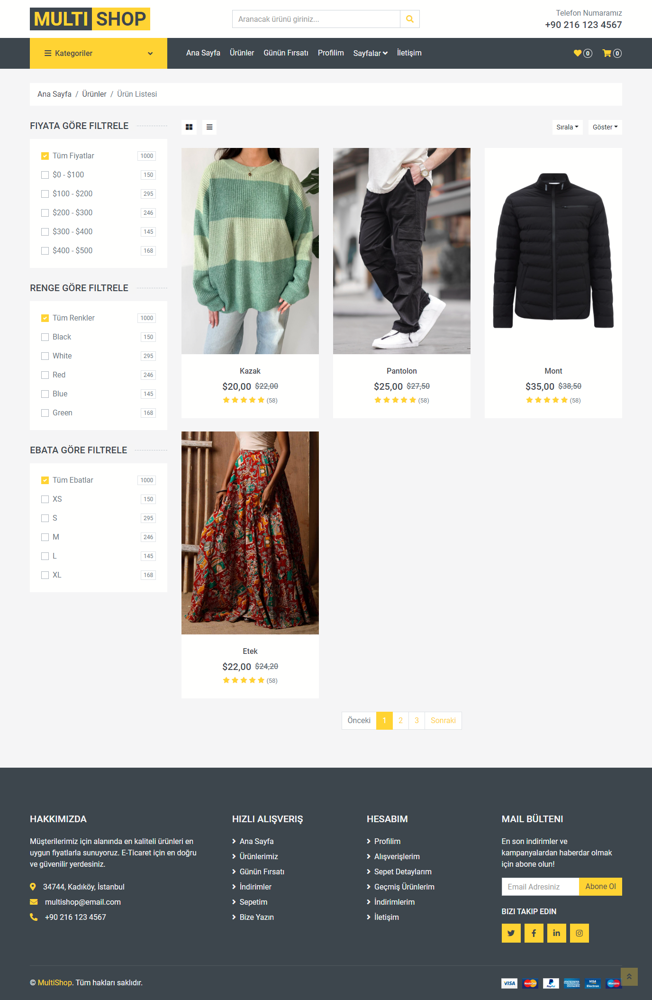

# MultiShop E-Ticaret Projesi

**MultiShop**, mikroservis mimarisiyle geliştirilmiş, web arayüzü ile kullanıcı ve admin panellerine sahip kapsamlı bir e-ticaret platformudur.

## Ana Özellikler:
- **Web Arayüzü:** Kullanıcılar, platforma kayıt olduktan sonra giriş yapabilirler. Platforma giriş yapan kullanıcılar ürünleri inceleyebilir ve ürünlere yorum yapıp puan verebilirler. Ayrıca ürünleri sepete ekleyip, indirim kuponu uygulayabilir ve adres bilgilerini girdikten sonra kredi kartı ile ödeme seçeneğini kullanarak alışverişlerini tamamlayabilirler.
- **Kullanıcı Paneli:** Kullanıcılar, profil bilgilerini yönetebilir, önceki siparişlerini ve gelen/gönderilen mesajları görüntüleyebilirler.
- **Admin Paneli:** Adminler, ürünler, kategoriler ve kargo firmalarını yönetebilir. Ayrıca kullanıcı listeleri, kullanıcı adres bilgileri ve ürün yorumlarına bu panel üzerinden erişebilirler.

## Kullanılan Teknolojiler
- **Backend:** Asp.Net Core 8.0, Asp.Net Core Web Api
- **Database:** MSSQL, PostgreSQL, MongoDB, Redis
- **ORM:** Entity Framework, Dapper
- **Mapping:** AutoMapper, Manual Mapping
- **Architecture:** N-Tier Architecture, Onion Architecture
- **Design Pattern:** Mediator Design Pattern, CQRS Design Pattern, Repository Design Pattern
- **Others:** Identity Server, JWT, Ocelot Gateway, SignalR, MediatR, Fluent Validation, Docker

## Mikroservisler ve Veritabanları
- **Catalog** > MongoDB (Local)
- **Discount** > MSSQL (Local)
- **Order** > MSSQL (Docker)
- **Cargo** > MSSQL (Docker)
- **Basket** > Redis (Docker)
- **Comment** > MSSQL (Docker)
- **Message** > PostgreSQL (Docker)
- **Identity** > MSSQL (Docker)

## Görseller
### Web Arayüzü

### Kayıt / Giriş Ekranları

### Kullanıcı Paneli

### Admin Paneli

### Mikroservisler
